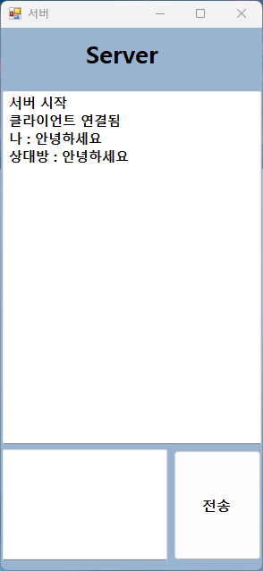
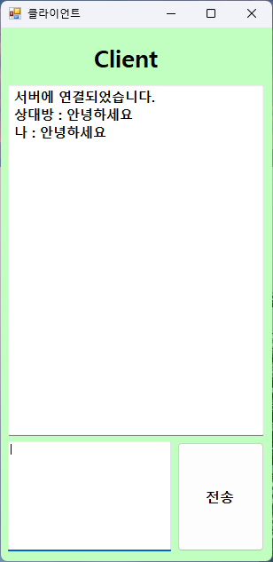

# 🗨️ TCP 채팅 프로그램

이 프로젝트는 Windows Forms (WinForms)을 이용해 구현된 간단한 TCP 기반 채팅 프로그램입니다. `TCPServer`와 `TCPClient` 두 애플리케이션으로 구성되어 있으며, 동일한 PC 또는 네트워크 내에서 메시지를 주고받을 수 있습니다.

## 📂 폴더 구조

```
📁 TCPClient        - 클라이언트 애플리케이션 소스
📁 TCPServer        - 서버 애플리케이션 소스

```

## 🚀 실행 방법

1. Visual Studio로 각각 `TCPServer`와 `TCPClient` 프로젝트를 실행합니다.
2. 먼저 `TCPServer`를 실행하여 서버를 시작합니다.
3. 이후 `TCPClient`를 실행하면 자동으로 서버에 연결됩니다.
4. 각 애플리케이션에서 메시지를 입력하고 **전송** 버튼을 누르면 채팅이 가능합니다.

## 🧩 주요 기능

- TCP 기반 실시간 채팅
- 별도의 스레드를 통한 메시지 수신
- WinForms UI 구성 (텍스트 입력창, 메시지 뷰, 전송 버튼)
- 로컬 IP 주소(`127.0.0.1`) 및 포트(`9000`) 사용

## 🖼️ 실행 화면

### ✅ 서버


### ✅ 클라이언트


## ⚙️ 기술 스택

- C# (.NET Framework)
- WinForms
- TCP 소켓 통신 (System.Net.Sockets)
- Thread (System.Threading)

## 📌 참고 사항

- 현재는 로컬 PC에서만 작동합니다. 원격 접속이 필요하다면 IP 주소를 실제 서버 IP로 수정하세요.